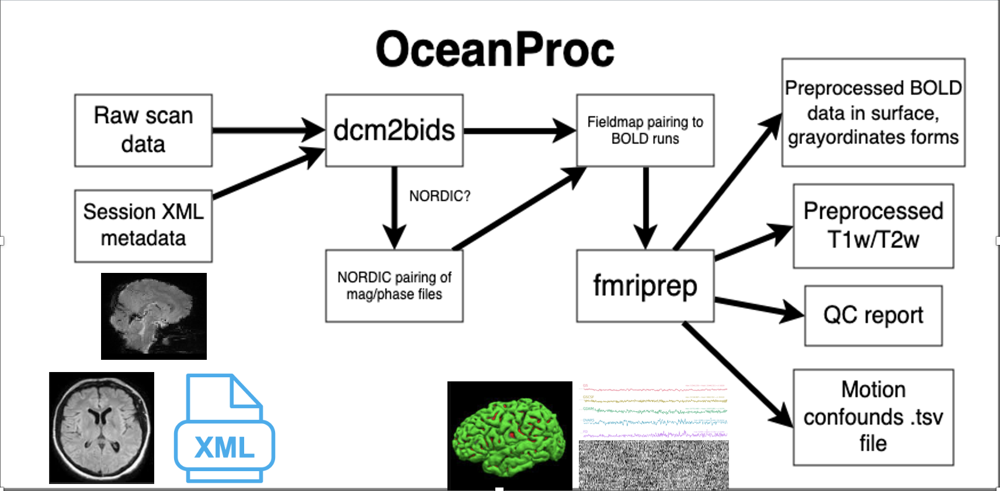

# oceanproc

## What is oceanproc?

`oceanproc` is a command-line utility that combines the utility of `dcm2bids` and `fmriprep`, along with some WashU-environment-specific code, to streamline the process of preprocessing neuroimaging data. 



`oceanproc` is meant to make the process of setting up a BIDS-compliant dataset as easy as possible by allowing for data fresh off the scanner to be used as input. As pictured in the diagram above, all the input that is needed is 1) the raw data, either in DICOM or NIFTI format, and 2) an XML file stored on CNDA containing usability scores for each scan (this is also used to pair fieldmaps to BOLD runs via a 'nearest neighbor' algorithm). 

## Usage

```
usage: oceanproc [-h] --subject SUBJECT --session SESSION --bids_path
                 BIDS_PATH --source_data SOURCE_DATA --xml_path XML_PATH
                 --bids_config BIDS_CONFIG [--nordic_config NORDIC_CONFIG]
                 [--nifti] [--skip_bids_validation] [--leave_workdir]
                 --derivs_path DERIVS_PATH --work_dir WORK_DIR --fs_license
                 FS_LICENSE [--fs_subjects_dir FS_SUBJECTS_DIR]
                 [--skip_dcm2bids] [--skip_fmap_pairing] [--skip_fmriprep]
                 [--export_args EXPORT_ARGS]  @[ARG_FILE]
```


